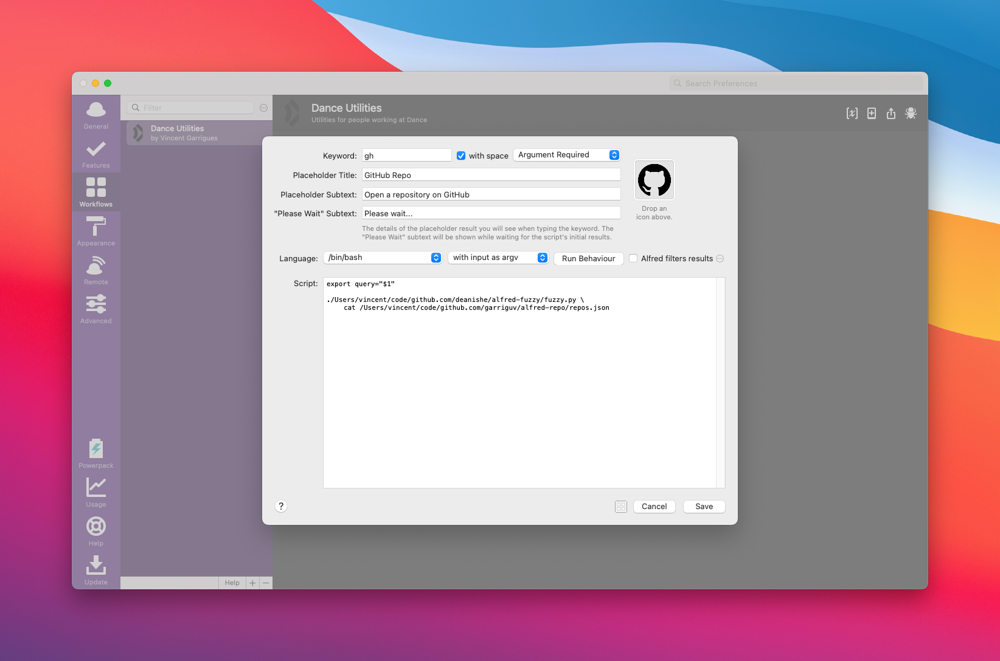

# Alfred Repo

## Generate the list of repos

```bash
go build
./alfred-repo -token <github api token> > repos.json
```

## Alfred workflow

Use [alfred-fuzzy](https://github.com/deanishe/alfred-fuzzy).

Create a new script filter action:



Use the following script:

```bash
export query="$1"

/path/to/fuzzy.py \
	cat /path/to/repos.json
```

Add an open URL action:


